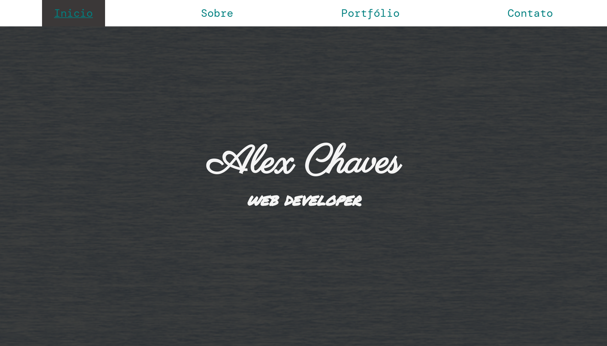
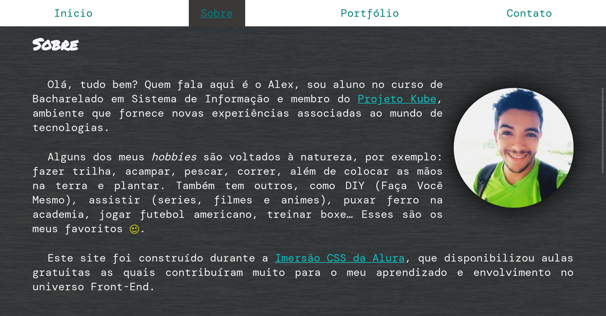
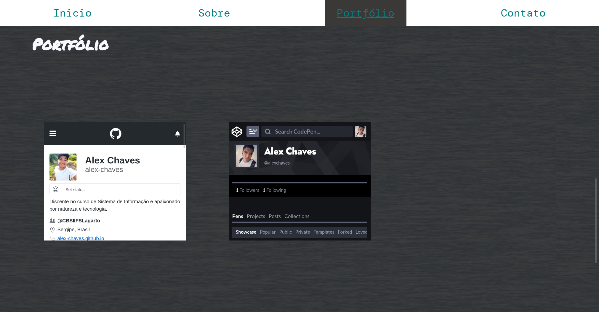
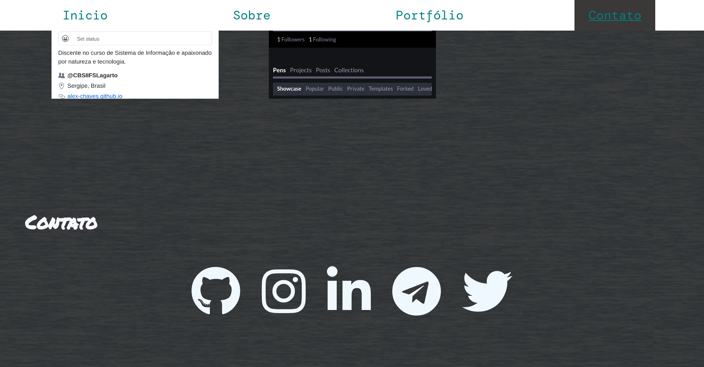

# Imersão CSS

Este projeto foi construído durante a [Imersão CSS da Alura](https://www.alura.com.br/imersao-css), que disponibilizou aulas gratuitas as quais contribuíram muito para o meu aprendizado e envolvimento no universo Front-End.

## Capturas de telas

### Tela inicial 

### Tela sobre

### Tela portfólio

### Tela contato

